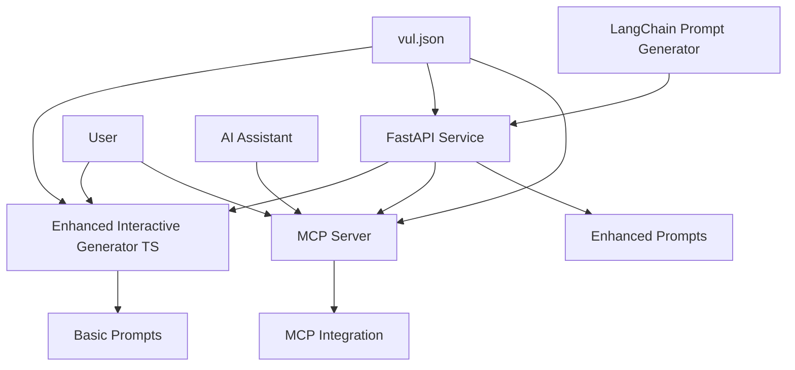

# 🚀 Enhanced Vulnerability Prompt Generator - Setup Guide

## 📋 Overview

This system provides an enhanced vulnerability prompt generation toolkit that transforms Fortify scan results into actionable AI prompts. The architecture consists of multiple interconnected components that can be used standalone or together for maximum enhancement.

## 🏗️ System Architecture



## 🔧 Components

### 1. **Core Data** (`vul.json`)
- Input file containing Fortify vulnerability scan results
- JSON format with vulnerability details, file paths, recommendations
- Sample provided with 3 Critical XSS vulnerabilities

### 2. **TypeScript Interactive Generator** (`enhanced_interactive_generator.ts`)
- Standalone interactive CLI tool
- Can operate independently or with FastAPI enhancement
- Provides user-friendly vulnerability selection and GitLab workflow integration
- Supports both basic and API-enhanced prompt generation

### 3. **LangChain Prompt Engine** (`langchain-prompt-generator.py`)
- Advanced prompt generation using LangChain framework
- Semantic similarity matching with vulnerability examples
- Chain-of-thought prompting capabilities
- Context-aware enhancements (framework detection, dependency analysis)

### 4. **FastAPI Service** (`fastapi_prompt_service.py`)
- REST API wrapping the LangChain functionality
- Provides endpoints for single and batch prompt generation
- Health checking and progress tracking
- File saving capabilities

### 5. **MCP Server** (`mcp_vuln_server_ts.ts`)
- Model Context Protocol server for AI assistant integration
- Session management and state tracking
- Tool-based interaction model
- Real-time API communication

## 🛠️ Setup Instructions

### Prerequisites

```bash
# Node.js and TypeScript
node --version  # v18+
npm install -g typescript ts-node

# Python and dependencies
python --version  # 3.8+
pip install --version
```

### 1. TypeScript Components Setup

```bash
# Install TypeScript dependencies
npm init -y
npm install axios zod readline fs path

# Install type definitions
npm install --save-dev @types/node @types/readline

# For MCP Server (additional)
npm install @modelcontextprotocol/sdk
```

### 2. Python Environment Setup

```bash
# Create virtual environment
python -m venv vuln-prompt-env
source vuln-prompt-env/bin/activate  # Linux/Mac
# OR
vuln-prompt-env\Scripts\activate  # Windows

# Install Python dependencies
pip install fastapi uvicorn pydantic
pip install langchain langchain-community
pip install sentence-transformers faiss-cpu
pip install huggingface-hub transformers
```

### 3. Directory Structure

```
vulnerability-prompt-system/
├── data/
│   └── vul.json                           # Input vulnerability data
├── src/
│   ├── enhanced_interactive_generator.ts  # Main TypeScript generator
│   ├── mcp_vuln_server_ts.ts             # MCP server
│   ├── langchain-prompt-generator.py      # LangChain engine
│   └── fastapi_prompt_service.py          # FastAPI service
├── output/
│   └── vulnerability_prompts/             # Generated prompts
├── docs/
│   └── example-interaction.md             # Usage examples
├── package.json                           # Node.js dependencies
├── requirements.txt                       # Python dependencies
└── README.md                             # This file
```

## 🚦 Quick Start

### Option 1: Standalone TypeScript (Basic)

```bash
# Compile and run basic generator
ts-node enhanced_interactive_generator.ts vul.json
```

### Option 2: Enhanced with FastAPI (Recommended)

```bash
# Terminal 1: Start FastAPI service
cd src/
python fastapi_prompt_service.py
# Server starts at http://localhost:8000

# Terminal 2: Run enhanced generator
ts-node enhanced_interactive_generator.ts vul.json
# Will automatically detect and use API enhancement
```

### Option 3: MCP Server Integration

```bash
# Start MCP server
ts-node mcp_vuln_server_ts.ts

# Connect from AI assistant using MCP protocol
# Available tools: load_vulnerabilities, configure_gitlab, etc.
```

## ⚙️ Configuration

### Environment Variables

```bash
# .env file
API_BASE_URL=http://localhost:8000
OUTPUT_DIR=vulnerability_prompts
SESSION_TIMEOUT=30000
```

### API Configuration

```bash
# Check FastAPI service
curl http://localhost:8000/health

# Test endpoint
curl -X POST http://localhost:8000/analyze-vulnerabilities \
  -H "Content-Type: application/json" \
  -d @vul.json
```

## 🎯 Usage Patterns

### 1. Development Workflow
```bash
# Daily developer usage
ts-node enhanced_interactive_generator.ts daily_scan.json
```

### 2. Security Team Batch Processing
```bash
# Process large vulnerability sets
python fastapi_prompt_service.py &
ts-node enhanced_interactive_generator.ts full_scan.json
```

### 3. AI Assistant Integration
```bash
# MCP integration for AI workflows
ts-node mcp_vuln_server_ts.ts
# Then use MCP tools from AI assistant
```

## 🔄 Data Flow

1. **Input**: `vul.json` contains Fortify scan results
2. **Processing**: Choose enhancement level:
   - Basic: TypeScript generator only
   - Standard: TypeScript + FastAPI + basic LangChain
   - Advanced: Full LangChain context enhancement
3. **Enhancement**: LangChain provides:
   - Semantic similarity matching
   - Framework detection
   - Security pattern recommendations
   - Chain-of-thought reasoning
4. **Output**: Enhanced prompts ready for LLM consumption

## 🚨 Troubleshooting

### Common Issues

**TypeScript compilation errors:**
```bash
npx tsc --init
npm install @types/node
```

**Python import errors:**
```bash
pip install --upgrade pip
pip install -r requirements.txt
```

**API connection failed:**
```bash
# Check if FastAPI is running
curl http://localhost:8000/health
# Restart service if needed
```

**MCP connection issues:**
```bash
# Verify MCP server is running
ps aux | grep mcp_vuln_server_ts
# Check port availability
netstat -an | grep 8000
```

## 📊 Performance Considerations

- **Basic Mode**: ~50ms per prompt (local only)
- **Enhanced Mode**: ~2-5s per prompt (includes LangChain processing)
- **Batch Mode**: Optimized for 10+ vulnerabilities
- **Memory Usage**: ~200MB for LangChain embeddings

## 🔐 Security Notes

- API runs on localhost by default
- No sensitive data stored in memory between sessions
- All generated prompts include security best practices
- GitLab tokens should be managed externally

## 🧪 Testing

```bash
# Test basic functionality
ts-node enhanced_interactive_generator.ts vul.json

# Test API endpoints
python -m pytest tests/test_api.py

# Test MCP tools
curl -X POST http://localhost:8000/health
```

## 📈 Scaling

- **Horizontal**: Run multiple FastAPI instances behind load balancer
- **Vertical**: Increase memory for larger LangChain models
- **Caching**: Add Redis for prompt caching in production

## 🤝 Integration Examples

### With GitHub Actions
```yaml
- name: Generate Security Prompts
  run: |
    ts-node enhanced_interactive_generator.ts scan_results.json
    # Upload prompts to artifact storage
```

### With GitLab CI/CD
```yaml
security_prompts:
  script:
    - python fastapi_prompt_service.py &
    - ts-node enhanced_interactive_generator.ts fortify_results.json
  artifacts:
    paths:
      - vulnerability_prompts/
```

## 📚 Additional Resources

- [LangChain Documentation](https://python.langchain.com/)
- [FastAPI Documentation](https://fastapi.tiangolo.com/)
- [Model Context Protocol](https://modelcontextprotocol.io/)
- [Fortify Integration Guide](docs/fortify-integration.md)

---

🎯 **Ready to transform your vulnerability management with AI-enhanced prompts!**